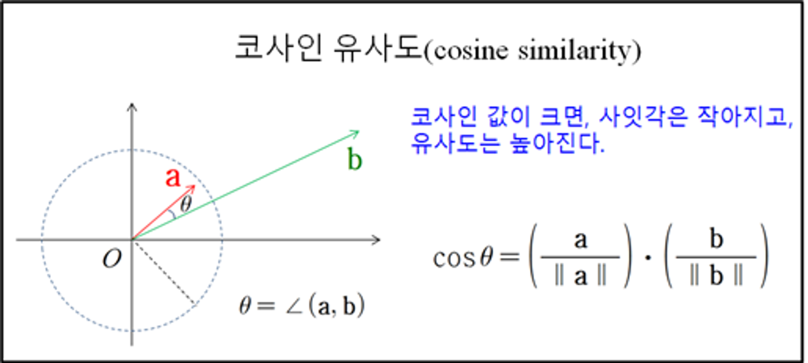

# 알프레도

 

## 👪 개발 멤버 소개

<table> 
  <tr> 
    <td height="140px" width="16.6%" align="center"> 
      <a href="https://github.com/dolpongg"> 
           👑 조성주  (Full-Stack) 
      </a> 
       
    </td> 
    <td height="140px" width="16.6%" align="center"> 
      <a href="https://github.com/xswaqz">  
           😆 권근열  (Full-Stack) 
      </a> 
       
    </td> 
    <td height="140px" width="16.6%" align="center"> 
      <a href="https://github.com/mickeyshoes"> 
           😶 권수지  (Full-Stack) 
      </a> 
       
    </td> 
    <td height="140px" width="16.6%" align="center"> 
      <a href="https://github.com/YongjaeKwon">
           🙄 김태완  (Full-Stack) 
      </a> 
       
    </td> 
    <td height="140px" width="16.6%" align="center"> 
      <a href="https://github.com/moxnox63">  
           😁 송의찬  (Full-Stack) 
      </a> 
       
    </td> 
    <td height="140px" width="16.6%" align="center"> 
      <a href="https://github.com/HanKyeon"> 
           🙂 최홍준  (Full-Stack) 
      </a> 
       
    </td> 
  </tr>
  <tr> 
    <td align="center">
      할 일 컴포넌트 FE/BE구현 
      요일별 할 일 완료 개수 API구현 
      유저별 전체 수행시간 API 구현 
      데이터 분할 관리 구현 
      업적 페이지 FE 구현
    </td>
    <td align="center">
      소셜 로그인 구현 
      루틴 추천 알고리즘 구현 
      ONE Store 앱 배포 
      마이페이지 FE/BE 구현 
      발표
    </td> 
    <td align="center">
      루틴 페이지 FE/BE 
      루틴 알림 구현 
      할 일 완료 유무 알림 구현 
      출석체크 구현 
      문서 작성
    </td>
    <td align="center">
      캘린더 페이지 FE, ical 
      메인페이지 FE 
      상점 페이지 FE 
      발표자료 준비
    </td>
    <td align="center">
      일정 등록 BE 구현 
      일정 알림 구현 
      데이터 분할 관리 구현 
      업적 관련 BE 구현 
      업적 달성 알림 구현 
      UCC
    </td>
    <td align="center">
      CI/CD 
      전체 일정 tts 구현 
      상점 API 구현 
      인프라
    </td>
  </tr>
</table>

 

## 📆 프로젝트 기간 

### 24.04.08 ~ 24.05.20

- 기획 및 설계 : 24.04.08 ~ 24.04.16
- 프로젝트 구현 : 24.04.17 ~ 24.05.14
- 버그 수정 및 산출물 정리 : 24.05.15 ~ 24.05.18

 

## 🛠️ 기술 스택

#### Front

 

#### Back

       

#### DB

 

#### Cloud

#### CI/CD

  

#### 기타

#### 협업 툴

  

 <b> 상세 기술스택 및 버전</b> 

| 구분     | 기술스택           | 상세내용              | 버전   |
| -------- | ------------------ | --------------------- | ------ |
| 공통     | Gitlab             | 형상관리              | \-     |
|          | Jira               | 이슈관리              | \-     |
|          | Mattermost, Notion | 커뮤니케이션          | \-     |
| FrontEnd | Flutter            | 프론트 프레임워크     | 3.19.5 |
|          | axios              | API 통신 라이브러리   | 1.6.7  |
|          | IDE                | Visual Studio Code    | \-     |
| BackEnd  | Java               | OpenJDK               | 17     |
|          | Spring Boot        | Java Server Framework | 3.2.5  |
|          | JPA                |                       | 3.2.4  |
|          | IntelliJ           | IDE                   | \-     |
|          | Flask              |                       | \-     |
|          | OAuth2             |                       | \-     |
|          | Gradle             | Build                 | 8.5    |
| DB       | MySQL              | DBMS                  | 8.0.36 |
|          | SQLLITE            |                       |        |
| Cloud    | Firebase           |                       |        |      
| Server   | AWS EC2            | Server                | \-     |
|          | Nginx              |                       | 1.24.0 |
|          | Docker             |                       | 25.0.4 |
|          | Jenkins            |                       | 2.448  |

 

## 실제 서비스 화면

tts(todo, 일정) open ai tts

첫 번째로, 서버는 인증된 사용자의 당일 할 일과 일정 데이터를 문자열(String) 형태로 가공합니다.

두 번째로, 서버는 OpenAI의 TTS API를 호출하여 오디오 스트림 데이터를 받아옵니다.

세 번째로, 서버는 OpenAI로부터 받은 오디오 스트림 데이터를 수집하여 하나의 바이트 배열(byte array)로 변환합니다.

네 번째로, 변환된 오디오 데이터를 클라이언트에 스트리밍 방식으로 전달합니다.

마지막으로, 클라이언트는 수신한 오디오 데이터를 파일로 저장한 후 재생하여 데이터의 정확성을 보장합니다.

이러한 과정을 통해, 저희 앱은 사용자에게 정확한 TTS 기능을 제공하며, 사용자의 편의성을 높입니다.

todo-timer, 반복 등록*수정*삭제, db조회속도 증가를 위한 4개월 테이블 분리

- timer : 할 일 별 타이머를 만들어 수행시간을 측정할 수 있는 기능을 만들었습니다. 또한 할 일 시간을 모두 더하여 5분 이상을 넘을 경우, 업적을 달성할 수 있도록 하였습니다.

- 반복 등록, 수정, 삭제 : UUID를 사용한 subIndex를 활용하여 할 일을 반복해서 등록, 수정하고 삭제할 수 있는 기능을 만들었습니다. 처음 반복 등록할 때 사용자가 시작, 종료 날짜와 요일을 설정하면 해당하는 날짜 모두에 todolist가 등록될 수 있도록 했습니다. 반복 할 일 등록을 할 때만 subIndex를 생성하도록 설정하였고, subIndex를 통해 수정과 삭제가 한꺼번에 가능하도록 설정했습니다.

- 4개월 테이블 분리 : 저희는 db조회속도 증가를 위해서 todo테이블과 oldtodo테이블 두 개의  todolist 관련 테이블을 만들었습니다. 새롭게 등록하는 todo는 우선적으로 todo테이블에 저장하도록 했습니다. 그리고 Scheduling을 활용하여, 매월 1일 오전 5시에 4개월 전의 데이터를 Oldtodo 라는 테이블로 이동하도록 함과 동시에 todo에서 4개월 전 데이터는 삭제하도록 구성했습니다.
일정또한 같은 형식으로 관리하여, 일정 조회속도도 증가시킬 수 있었습니다.

| 메인페이지(TTS 기능) | 할 일 |
|----------------------|--------|
| 
  | 
  |

| 일정 | 일정 알람 |
|------|----------|
| 
  | 
  |

 

루틴 추천(flask,cosine유사도)

- 유저의 설문조사 답변을 기반으로 가장 유사한 유저들을 찾아, 그들이 사용하는 기본 루틴을 추천합니다.
- 파이썬의 다양한 라이브러리들을 활용하기 위해 따로 flask서버를 구축하고 메인서버인 spring boot 서버와 통신합니다.

캘린더_ical(kakao,google 캘린더)

위 부분에 날짜 클릭시 달 별로 선택 가능한 기능 있고, 달 뒤에 년을 클릭하면 년도 선택이 가능합니다. 
날짜 옆에 달력 모형 클릭하면 오늘 날짜 페이지로 이동 가능합니다. 
햄버거 클릭시 보고 싶은 캘린더 모형 선택이 가능합니다.

- iCal 데이터는 파란색, 
- 할 일은 갈색, 
- 일정은 베이지색 입니다.
    - 각 컴포넌트 터치(클릭)시 수정, 삭제 모달 띄워 주는 기능이 있습니다.

캘린더 모형별 기능 

- 모형 Day : 할 일,하루 종일on한 일정은 위에 표시됨 (3개 이상 넘어가면 아코디언 형식으로 띄웁니다.), 시간대를 설정한 일정은 그 시간대에 맞게 컴포넌트가 생성됩니다.

- 모형 Week: 할 일, 하루 종일on한 일정은 위에 표시됩니다. (2개 이상이면 아코디언 형식으로 띄웁니다.), 시간대를 설정한 일정은 그 시간대에 맞게 컴포넌트가 생성됩니다.

- 모형 month: 각 날짜 누르거나 위로 올리면 컴포넌트를 볼 수 있는 공간이 나옵니다., 위로 한번더 올리면 위 공간이 선택한 날 기준 1주로 바뀌며 컴포넌트를 보는 공간이 늘어남

- 모형 schedule: 무한 스크롤로 데이터를 계속 볼 수 있습니다.

업적, 상점(재미요소)

- 업적
    - 사용자가 특정 조건을 만족하면 업적 자동으로 달성합니다.
        - 총 일정의 갯수, 총 출석일수, 로그인한 날이 생일인 경우 등등
    - 업적 달성시 푸쉬알림과 함께 50개의 코인 얻을 수 있습니다.
- 코인
    - 업적 1개 달성시 50개 획득
    - 할 일을 체크하면 5개씩 하루에 최대 50개 얻을 수 있습니다.
- 상점

일정(푸시알림)-fcm

- 일정
    - 사용자는 일정의 시작 종료 날짜를 선택하고, 하루 종일 선택하지 않은 경우 일정의 시작시간, 종료시간을 입력할 수 있습니다.
    - 알림 사용 선택한 경우 일정 시작전 혹은 커스텀을 통해 원하는 시간에 알림을 받을 수 있습니다.
- FCM
    - Quartz를 사용해 구현했습니다.
        - Quartz - java 기반 작업 스케쥴링 라이브러리
    - 구동 순서
        1. Job으로 보낼 메세지 정의합니다.
        2. SimpleTrigger로  알림시간 설정합니다.
        3. Scheduler로 Job과 trigger를 연결후 실행합니다.

시스템 아키텍쳐

1. **GitLab Webhook을 통한 Jenkins CI/CD**:
    - GitLab의 Webhook을 사용하여 Jenkins에서 CI/CD 파이프라인을 트리거합니다. 이를 통해 코드가 커밋되면 자동으로 빌드 및 배포가 이루어집니다.
2. **개발 서버와 배포 서버의 트래픽 분리**:
    - NGINX 리버스 프록시를 사용하여 개발 서버(dev.myalfredo.me)와 배포 서버(myalfredo.me)의 트래픽을 분리합니다.
    - 배포 서버는 포트 8080에서, 개발 서버는 포트 8082에서 각각 Spring 애플리케이션으로의 요청을 처리합니다.
3. **Docker 네트워크 구성을 통한 외부 통신 차단**:
    - Docker 네트워크를 사용하여 각 서비스 간의 내부 통신을 관리하고, 외부 네트워크로의 접근을 제한합니다.
    - 배포와 개발 환경 모두에서 독립적인 네트워크를 사용하여 격리된 환경을 제공합니다.

<!-- ##### 일정(푸시알림)-fcm

###### 일정
- 사용자는 일정의 시작 종료 날짜를 선택하고, 하루 종일 선택하지 않은 경우 일정의 시작시간, 종료시간을 입력할 수 있습니다.
- 알림 사용 선택한 경우 일정 시작 전 혹은 커스텀을 통해 원하는 시간에 알림을 받을 수 있습니다.

###### FCM
- Quartz를 사용해 구현했습니다.
    - Quartz - Java 기반 작업 스케줄링 라이브러리
- 구동 순서
    1. Job으로 보낼 메시지를 정의합니다.
    2. SimpleTrigger로 알림 시간 설정합니다.
    3. Scheduler로 Job과 Trigger를 연결 후 실행합니다. -->

